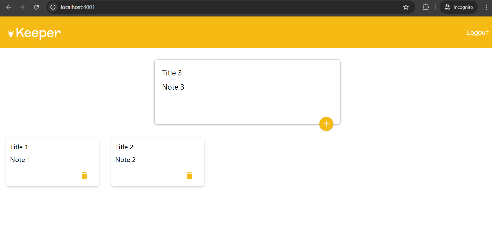
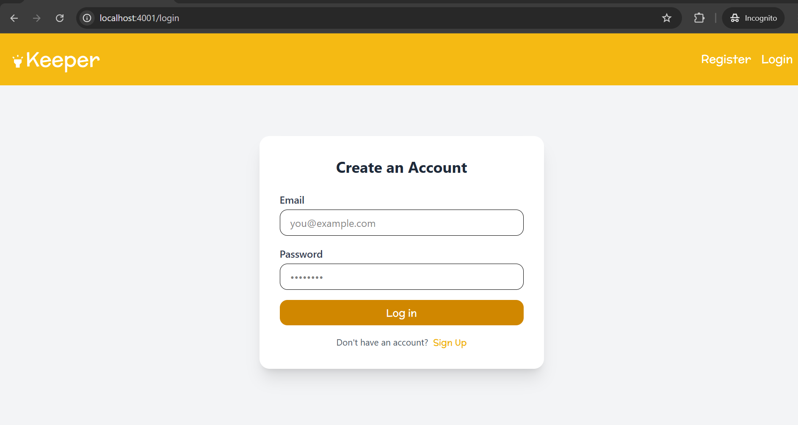
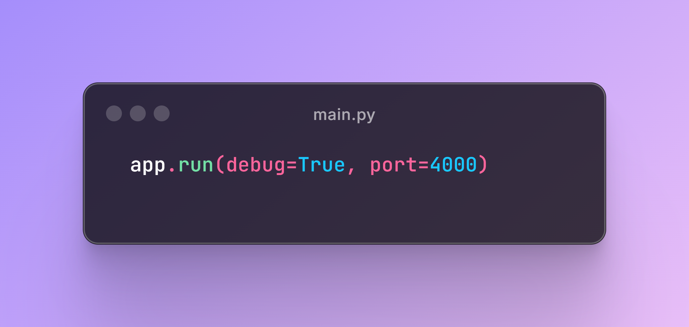
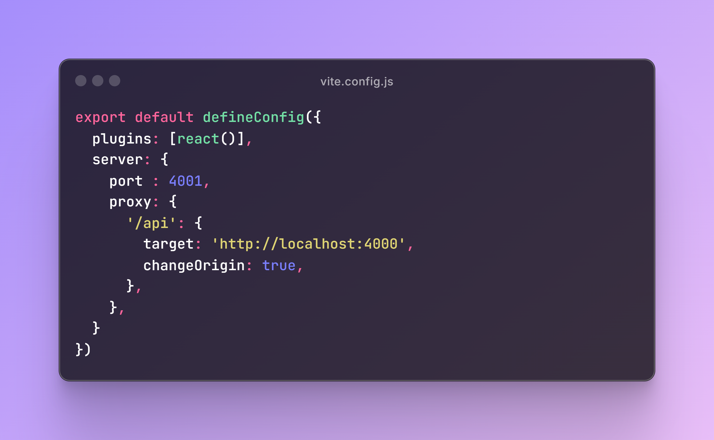

# Note Keeper (React + Flask)

Home page:

Login page:

___
## How to clone and run on your PC
### Cloning

To clone, run `git clone https://github.com/m-sabonkudi/ReactFlask-NoteKeeper.git`

___
### Running on PC

First, go into the project directory `cd ReactFlask-NoteKeeper`

___
#### Set up Flask
Create a new virtual environment: `cd server` -> `python -m venv venv` (windows) or `python3 -m venv venv` (mac)

You should now have a folder named venv in your flask directory containing the virtual environment.

Activate the just-created virtual environment: `venv\Scripts\activate` (windows) or `source venv/bin/activate` (mac)

Install required python libraries: `pip install -r requirements.txt` (windows) or `pip3 install -r requirements.txt` (mac)

___
#### Set up React
Install react dependencies: `cd client` -> `npm install`

___
#### Run Flask
`python app.py` (windows) or `python3 app.py` (mac)

___
#### Run React
`npm run dev`

Now you can go to this link in your browser: 🟢 [http://localhost:4001](http://localhost:4001)

___
### What actually enables the backend (flask) and frontend (react.js) to interact with each other?
If you at the last line in the `main.py` file, you'll see:

This tells flask to host the app on port `4000`. Now that our flask app is running on port `4000`, we now need to configure our react app to fetch backend data from that port. To do that, you can see lines `5-16` in `vite.config.js`, like so:

By default, (when using vite) react runs on port `5173`, the line `port : 4001,` asks react not to use the default port but should run on port `4001` instead.
We then configured the react app to send any requests beginning with `/api` to the port `http://localhost:4000`, which is where our flask app is running.

